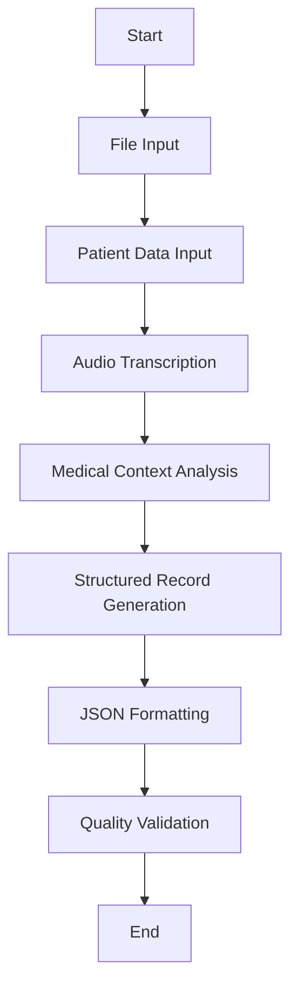

# Dify エージェント構築手順書 - 音声自動カルテシステム

## 目次
1. [Dify アカウント設定](#dify-アカウント設定)
2. [ワークスペース作成](#ワークスペース作成)
3. [音声処理ワークフロー構築](#音声処理ワークフロー構築)
4. [ブロック詳細設定手順](#ブロック詳細設定手順)
5. [医療記録生成プロンプト設定](#医療記録生成プロンプト設定)
6. [ワークフローテスト](#ワークフローテスト)
7. [API設定とシステム統合](#api設定とシステム統合)
8. [トラブルシューティング](#トラブルシューティング)

## Dify アカウント設定

### 1. Dify アカウント作成
1. **Dify公式サイトにアクセス**: https://dify.ai/
2. **アカウント登録**:
   - 「Sign Up」をクリック
   - メールアドレスとパスワードを入力
   - メール認証を完了

3. **プラン選択**:
   - 開発・テスト用: **Free Plan** (月間200リクエスト)
   - 本格運用: **Pro Plan** または **Team Plan** を推奨

### 2. 初期設定
```
ログイン後の設定:
- Organization Name: 飯田クリニック (または任意の名前)
- Workspace Name: 音声カルテシステム
- Region: Asia Pacific (推奨)
```

## ワークスペース作成

### 1. 新しいアプリケーション作成
1. **ダッシュボードから「Create App」をクリック**
2. **アプリケーション設定**:
   ```
   App Name: 音声自動カルテ生成
   App Type: Agent
   Description: 飯田クリニック向け音声診察記録自動生成システム
   ```

### 2. 基本設定
```yaml
Application Settings:
  - Language: Japanese (日本語)
  - Model: GPT-4 (推奨) または GPT-3.5-turbo
  - Temperature: 0.3 (一貫性重視)
  - Max Tokens: 2000
  - Top P: 0.9
```

## 音声処理ワークフロー構築

### 1. ワークフロー作成の開始

#### A. Dify Studio へのアクセス
1. **Dify ダッシュボードにログイン**
2. **「Studio」タブをクリック**
3. **「Create Workflow」ボタンを選択**
4. **ワークフロー設定**:
   ```
   Workflow Name: 音声自動カルテ生成ワークフロー
   Description: 飯田クリニック向け診察音声からの医療記録自動生成
   Type: Chat Workflow
   ```

#### B. ワークフロー全体設計


### 2. 入力ブロックの設定

#### A. ファイル入力ブロック作成
1. **左サイドバーから「File」ブロックをドラッグ**
2. **ブロック設定**:
   ```
   Block Name: audio_file_input
   Description: 診察音声ファイルの受信
   File Types: audio/wav, audio/mp3, audio/m4a
   Max File Size: 10MB
   Required: Yes
   ```

#### B. 患者データ入力ブロック作成
1. **「Text Input」ブロックを4つ追加**
2. **各ブロックの詳細設定**:

**患者名入力ブロック**:
```
Block Name: patient_name_input
Label: 患者名
Placeholder: 例: 田中太郎
Required: Yes
Max Length: 50
```

**患者ID入力ブロック**:
```
Block Name: patient_id_input
Label: 患者ID
Placeholder: 例: P-2025-001
Required: Yes
Pattern: P-\d{4}-\d{3}
```

**年齢入力ブロック**:
```
Block Name: patient_age_input
Label: 年齢
Placeholder: 例: 45
Required: Yes
Type: Number
Min: 0, Max: 120
```

**性別入力ブロック**:
```
Block Name: patient_gender_input
Label: 性別
Type: Select
Options: ["男性", "女性"]
Required: Yes
```

## ブロック詳細設定手順

### 1. 音声転写ブロック設定

#### A. Speech-to-Text ブロック追加
1. **左サイドバーから「Speech-to-Text」ブロックをドラッグ**
2. **ブロック配置**: ファイル入力ブロックの後に配置
3. **接続**: `audio_file_input` の出力を `Speech-to-Text` の入力に接続

#### B. 音声転写ブロック詳細設定
```yaml
Block Name: audio_transcription
Settings:
  Model: whisper-1
  Language: ja (Japanese)
  Response Format: text
  Temperature: 0.0
  Prompt: |
    この音声は日本の内科・消化器内科クリニックでの診察記録です。
    医療用語を正確に転写してください。
    特に以下の用語に注意してください：
    - 症状: 腹痛、下痢、便秘、胸やけ、嘔吐
    - 検査: 胃カメラ、大腸カメラ、腹部エコー、血液検査
    - 診断: 胃炎、胃潰瘍、過敏性腸症候群、逆流性食道炎
    - 薬剤: PPI、H2ブロッカー、整腸剤、止痢剤
```

### 2. 患者情報統合ブロック設定

#### A. Variable Aggregator ブロック追加
1. **「Code」ブロックをドラッグして追加**
2. **ブロック名**: `patient_data_aggregation`
3. **入力接続**: 
   - `audio_transcription` の出力
   - 全ての患者データ入力ブロックの出力

#### B. 統合コード設定
```python
def main(audio_transcript: str, patient_name: str, patient_id: str, 
         patient_age: str, patient_gender: str) -> dict:
    """
    患者データと音声転写結果を統合
    """
    import json
    from datetime import datetime
    
    # 現在時刻を診察日時として設定
    consultation_date = datetime.now().strftime("%Y-%m-%d %H:%M")
    
    # 統合データ作成
    integrated_data = {
        "patient_info": {
            "name": patient_name,
            "id": patient_id,
            "age": patient_age,
            "gender": patient_gender,
            "consultation_date": consultation_date
        },
        "audio_transcript": audio_transcript,
        "clinic_info": {
            "name": "芦屋Ⓡいいだ内科クリニック",
            "specialties": ["内科", "消化器内科"],
            "services": ["胃カメラ", "大腸カメラ", "腹部エコー"]
        }
    }
    
    return {
        "integrated_data": json.dumps(integrated_data, ensure_ascii=False, indent=2)
    }
```

### 3. 医療記録生成LLMブロック設定

#### A. LLM ブロック追加と配置
1. **「LLM」ブロックをドラッグして追加**
2. **ブロック名**: `medical_record_generator`
3. **入力接続**: `patient_data_aggregation` の出力を接続

#### B. LLM モデル設定
```yaml
Model Configuration:
  Provider: OpenAI
  Model: gpt-4-turbo-preview
  Temperature: 0.2
  Max Tokens: 2000
  Top P: 0.9
  Frequency Penalty: 0.0
  Presence Penalty: 0.0
```

#### C. システムプロンプト設定
```
あなたは芦屋Ⓡいいだ内科クリニックの経験豊富な医師です。
内科・消化器内科の専門知識を持ち、正確で詳細な医療記録を作成します。

【専門分野】
- 消化器内科: 胃炎、胃潰瘍、十二指腸潰瘍、逆流性食道炎、過敏性腸症候群、脂肪肝、胆石症
- 内科一般: 高血圧、糖尿病、脂質異常症、上気道炎、気管支炎
- 検査: 胃カメラ、大腸カメラ、腹部エコー、血液検査、心電図

【記録作成方針】
1. 患者の訴えを正確に記録
2. 医学的に適切な用語を使用
3. 診断根拠を明確に記載
4. 治療方針を具体的に示す
5. 患者指導内容を詳細に記録

【出力形式】
必ず以下のJSON形式で出力してください。各項目は日本語で記載し、医学的に正確な内容にしてください。
```

#### D. ユーザープロンプト設定
```
以下の患者情報と診察音声転写から、構造化された医療記録を生成してください。

{{integrated_data}}

上記の情報を基に、以下のJSON形式で医療記録を作成してください：

{
  "patient_id": "患者ID",
  "consultation_date": "診察日時 (YYYY-MM-DD HH:MM)",
  "chief_complaint": "主訴 - 患者が最も困っている症状",
  "present_illness": "現病歴 - 症状の詳細、経過、随伴症状",
  "physical_examination": "身体所見 - 診察で確認された客観的所見",
  "diagnosis": "診断 - 医学的判断に基づく診断名",
  "prescription": "処方 - 処方薬の詳細（薬剤名、用法用量）",
  "guidance": "指導内容 - 生活指導、注意事項、食事指導等",
  "next_appointment": "次回予約 - フォローアップの予定",
  "notes": "備考 - その他重要な情報、検査予定等"
}

【重要な注意事項】
- 消化器内科・内科の専門用語を適切に使用
- 症状の程度や部位を具体的に記載
- 処方薬は一般名で記載し、用法用量を明記
- 患者への指導は具体的で実践可能な内容に
- 診断は音声内容に基づき、推測は避ける
```

### 4. JSON整形・検証ブロック設定

#### A. JSON Formatter ブロック追加
1. **「Code」ブロックを追加**
2. **ブロック名**: `json_formatter_validator`
3. **入力接続**: `medical_record_generator` の出力を接続

#### B. JSON整形・検証コード
```python
def main(llm_output: str) -> dict:
    """
    LLM出力をJSON形式に整形し、必須項目を検証
    """
    import json
    import re
    from datetime import datetime
    
    try:
        # JSON部分を抽出（LLMが余分なテキストを含む場合に対応）
        json_match = re.search(r'\{.*\}', llm_output, re.DOTALL)
        if json_match:
            json_str = json_match.group()
        else:
            json_str = llm_output
        
        # JSONパース
        medical_record = json.loads(json_str)
        
        # 必須項目の検証
        required_fields = [
            "patient_id", "consultation_date", "chief_complaint",
            "present_illness", "physical_examination", "diagnosis",
            "prescription", "guidance", "next_appointment", "notes"
        ]
        
        for field in required_fields:
            if field not in medical_record or not medical_record[field]:
                medical_record[field] = "記載なし"
        
        # 診察日時の形式確認
        if not re.match(r'\d{4}-\d{2}-\d{2} \d{2}:\d{2}', medical_record["consultation_date"]):
            medical_record["consultation_date"] = datetime.now().strftime("%Y-%m-%d %H:%M")
        
        return {
            "medical_record": json.dumps(medical_record, ensure_ascii=False, indent=2),
            "validation_status": "success",
            "record_summary": f"患者ID: {medical_record['patient_id']}, 主訴: {medical_record['chief_complaint']}"
        }
        
    except json.JSONDecodeError as e:
        # JSON解析エラーの場合のフォールバック
        fallback_record = {
            "patient_id": "PARSE_ERROR",
            "consultation_date": datetime.now().strftime("%Y-%m-%d %H:%M"),
            "chief_complaint": "JSON解析エラーが発生しました",
            "present_illness": llm_output[:200] + "...",
            "physical_examination": "記載なし",
            "diagnosis": "記録生成エラー",
            "prescription": "記載なし",
            "guidance": "システム管理者にお問い合わせください",
            "next_appointment": "記載なし",
            "notes": f"エラー詳細: {str(e)}"
        }
        
        return {
            "medical_record": json.dumps(fallback_record, ensure_ascii=False, indent=2),
            "validation_status": "error",
            "record_summary": "JSON解析エラー"
        }
```

### 5. 出力ブロック設定

#### A. 最終出力ブロック追加
1. **「End」ブロックを追加**
2. **ブロック名**: `workflow_output`
3. **入力接続**: `json_formatter_validator` の出力を接続

#### B. 出力設定
```yaml
Output Configuration:
  Primary Output: medical_record
  Additional Outputs:
    - validation_status
    - record_summary
  Response Format: JSON
  Success Message: "医療記録が正常に生成されました"
  Error Message: "医療記録の生成中にエラーが発生しました"
```

## 医療記録生成プロンプト設定

### 1. 高度なプロンプトエンジニアリング

#### A. 専門用語データベース設定
Dify Studio内で「Knowledge Base」を作成し、医療用語辞書を構築：

**消化器内科専門用語集**:
```yaml
症状・所見:
  - 腹痛: "上腹部痛、下腹部痛、心窩部痛、側腹部痛"
  - 下痢: "水様便、軟便、粘血便、脂肪便"
  - 便秘: "排便困難、残便感、腹部膨満感"
  - 胸やけ: "胸骨後部灼熱感、酸逆流、嚥下困難"
  - 嘔吐: "悪心、嘔気、食物残渣、胆汁性"

疾患名:
  - 胃炎: "急性胃炎、慢性胃炎、萎縮性胃炎、表層性胃炎"
  - 胃潰瘍: "胃角部潰瘍、前庭部潰瘍、穿孔性潰瘍"
  - 十二指腸潰瘍: "球部潰瘍、多発性潰瘍"
  - 逆流性食道炎: "GERD、食道びらん、Barrett食道"
  - 過敏性腸症候群: "IBS、便秘型、下痢型、混合型"
  - 脂肪肝: "NAFLD、NASH、アルコール性脂肪肝"

検査・処置:
  - 内視鏡: "上部消化管内視鏡、大腸内視鏡、生検"
  - 画像検査: "腹部エコー、CT、MRI、造影検査"
  - 血液検査: "肝機能、腎機能、炎症反応、腫瘍マーカー"

薬剤:
  - PPI: "オメプラゾール、ランソプラゾール、エソメプラゾール"
  - H2ブロッカー: "ファモチジン、ラニチジン"
  - 整腸剤: "ビオフェルミン、ラックビー、ミヤBM"
  - 止痢剤: "ロペラミド、タンニン酸アルブミン"
```

**内科一般用語集**:
```yaml
生活習慣病:
  - 高血圧: "本態性高血圧、二次性高血圧、白衣高血圧"
  - 糖尿病: "1型糖尿病、2型糖尿病、境界型糖尿病"
  - 脂質異常症: "高コレステロール血症、高中性脂肪血症"
  - メタボリックシンドローム: "内臓脂肪型肥満、インスリン抵抗性"

感染症:
  - 上気道炎: "感冒、咽頭炎、扁桃炎、副鼻腔炎"
  - 下気道炎: "気管支炎、肺炎、気管支肺炎"
  - 胃腸炎: "急性胃腸炎、感染性胃腸炎、ウイルス性胃腸炎"

薬剤:
  - 降圧薬: "ACE阻害薬、ARB、Ca拮抗薬、利尿薬"
  - 糖尿病薬: "メトホルミン、DPP-4阻害薬、SGLT2阻害薬"
  - 抗菌薬: "ペニシリン系、セフェム系、マクロライド系"
```

#### B. コンテキスト認識プロンプト設定

**診察パターン認識プロンプト**:
```
以下の診察パターンを認識し、適切な医療記録を生成してください：

【主訴別アプローチ】
1. 腹痛の場合:
   - 部位: 心窩部、右上腹部、左上腹部、臍周囲、下腹部
   - 性状: 鈍痛、刺すような痛み、締め付けられる痛み
   - 随伴症状: 嘔吐、下痢、発熱、食欲不振
   - 誘因: 食事、ストレス、体位変換

2. 下痢の場合:
   - 回数: 1日の排便回数
   - 性状: 水様、軟便、粘血便
   - 随伴症状: 腹痛、発熱、脱水症状
   - 経過: 急性、慢性、間欠的

3. 健診異常の場合:
   - 異常項目: 肝機能、血糖値、コレステロール
   - 数値: 具体的な検査値
   - 自覚症状: 有無と詳細
   - 生活習慣: 食事、運動、飲酒、喫煙

【身体所見記録パターン】
- バイタルサイン: 血圧、脈拍、体温、呼吸数、SpO2
- 一般状態: 意識レベル、栄養状態、皮膚色、浮腫
- 腹部所見: 視診（膨隆、陥凹）、聴診（腸音）、打診、触診（圧痛、腫瘤）
- その他: 心音、呼吸音、リンパ節触知、神経学的所見
```

#### C. 品質保証プロンプト

**医療記録品質チェックプロンプト**:
```
生成した医療記録について、以下の品質基準を満たしているか確認してください：

【必須項目チェック】
✓ 患者ID: 正しい形式（P-YYYY-XXX）
✓ 診察日時: YYYY-MM-DD HH:MM形式
✓ 主訴: 患者の言葉で表現された症状
✓ 現病歴: 時系列に沿った症状の経過
✓ 身体所見: 客観的な診察所見
✓ 診断: 医学的根拠に基づく診断名
✓ 処方: 薬剤名、用法用量の明記
✓ 指導内容: 具体的で実践可能な指導
✓ 次回予約: フォローアップの必要性
✓ 備考: 重要な追加情報

【品質基準】
- 医学用語の正確性: 専門用語の適切な使用
- 論理的整合性: 症状→所見→診断の流れ
- 具体性: 曖昧な表現を避け、具体的に記載
- 完全性: 必要な情報の漏れがないか
- 読みやすさ: 医療従事者が理解しやすい文章

【エラー回避】
- 推測による診断は避ける
- 音声で言及されていない情報は追加しない
- 薬剤名は一般名で記載
- 用法用量は標準的な範囲内で記載
```

### 2. 診察シナリオ別プロンプトテンプレート

#### A. 消化器内科外来プロンプト
```
【消化器内科外来専用プロンプト】

あなたは芦屋Ⓡいいだ内科クリニックの消化器内科専門医です。
以下の診察音声から、消化器疾患に特化した医療記録を作成してください。

特に注意すべき点：
1. 腹部症状の詳細な記録（部位、性状、随伴症状）
2. 食事との関連性
3. 排便状況の詳細
4. 既往歴（胃潰瘍、大腸ポリープ等）
5. 内視鏡検査の必要性判断
6. 生活指導の具体的内容

診断時の考慮事項：
- 機能性消化管疾患 vs 器質的疾患
- 緊急性の判断
- 専門検査の適応
- 薬物療法の選択
```

#### B. 生活習慣病外来プロンプト
```
【生活習慣病外来専用プロンプト】

生活習慣病（高血圧、糖尿病、脂質異常症）の管理に特化した記録を作成してください。

重要な記録項目：
1. 血圧値、血糖値、HbA1c、コレステロール値
2. 服薬状況とアドヒアランス
3. 食事内容と運動習慣
4. 体重変化と BMI
5. 合併症の有無（網膜症、腎症、神経症等）
6. 生活指導の具体的内容

管理目標：
- 血圧: 130/80 mmHg未満
- HbA1c: 7.0%未満（個別化）
- LDL-C: 120 mg/dL未満
- 体重: 適正BMI維持
```

#### C. 健診フォローアップ外来プロンプト
```
【健診フォローアップ外来専用プロンプト】

健康診断の異常値に対するフォローアップ診察の記録を作成してください。

記録すべき内容：
1. 健診での異常項目と数値
2. 再検査結果との比較
3. 自覚症状の有無
4. 生活習慣の詳細聴取
5. 精密検査の必要性
6. 治療開始の判断根拠

フォローアップ方針：
- 経過観察 vs 治療開始
- 生活習慣改善指導
- 次回検査時期の設定
- 専門医紹介の必要性
```

### 3. 出力品質最適化設定

#### A. JSON スキーマ検証
```json
{
  "$schema": "http://json-schema.org/draft-07/schema#",
  "type": "object",
  "required": [
    "patient_id", "consultation_date", "chief_complaint",
    "present_illness", "physical_examination", "diagnosis",
    "prescription", "guidance", "next_appointment", "notes"
  ],
  "properties": {
    "patient_id": {
      "type": "string",
      "pattern": "^P-\\d{4}-\\d{3}$"
    },
    "consultation_date": {
      "type": "string",
      "pattern": "^\\d{4}-\\d{2}-\\d{2} \\d{2}:\\d{2}$"
    },
    "chief_complaint": {
      "type": "string",
      "minLength": 1,
      "maxLength": 200
    },
    "present_illness": {
      "type": "string",
      "minLength": 1,
      "maxLength": 1000
    },
    "physical_examination": {
      "type": "string",
      "minLength": 1,
      "maxLength": 500
    },
    "diagnosis": {
      "type": "string",
      "minLength": 1,
      "maxLength": 200
    },
    "prescription": {
      "type": "string",
      "minLength": 1,
      "maxLength": 500
    },
    "guidance": {
      "type": "string",
      "minLength": 1,
      "maxLength": 500
    },
    "next_appointment": {
      "type": "string",
      "minLength": 1,
      "maxLength": 100
    },
    "notes": {
      "type": "string",
      "maxLength": 500
    }
  }
}
```

#### B. 品質スコアリング設定
```python
def calculate_quality_score(medical_record: dict) -> float:
    """
    医療記録の品質スコアを計算
    """
    score = 0.0
    max_score = 100.0
    
    # 必須項目の完全性 (40点)
    required_fields = ["patient_id", "chief_complaint", "diagnosis", "prescription"]
    for field in required_fields:
        if field in medical_record and medical_record[field] and medical_record[field] != "記載なし":
            score += 10.0
    
    # 詳細度の評価 (30点)
    detail_fields = ["present_illness", "physical_examination", "guidance"]
    for field in detail_fields:
        if field in medical_record and len(medical_record[field]) > 50:
            score += 10.0
    
    # 医学用語の適切性 (20点)
    medical_terms = ["症状", "所見", "診断", "処方", "指導"]
    content = " ".join(medical_record.values())
    for term in medical_terms:
        if term in content:
            score += 4.0
    
    # 構造化の品質 (10点)
    if all(field in medical_record for field in ["patient_id", "consultation_date"]):
        score += 10.0
    
    return min(score, max_score)
```

## ワークフローテスト

### 1. Dify Studio内でのテスト

#### A. 単体ブロックテスト
各ブロックを個別にテストして動作を確認：

**音声転写ブロックテスト**:
1. **テスト音声ファイル準備**:
   ```
   テスト内容: "田中太郎さん、45歳男性です。3日前から腹痛と下痢が続いています。
   特に食後に症状が強くなります。熱はありません。"
   ファイル形式: WAV, 16kHz, モノラル
   ```

2. **テスト実行**:
   - Dify Studio で音声転写ブロックを選択
   - 「Test」ボタンをクリック
   - テスト音声ファイルをアップロード
   - 転写結果を確認

3. **期待される結果**:
   ```
   転写テキスト: "田中太郎さん、45歳男性です。3日前から腹痛と下痢が続いています。
   特に食後に症状が強くなります。熱はありません。"
   精度: 95%以上
   処理時間: 10秒以内
   ```

**LLMブロックテスト**:
1. **テストデータ入力**:
   ```json
   {
     "patient_info": {
       "name": "田中太郎",
       "id": "P-2025-001",
       "age": "45",
       "gender": "男性"
     },
     "audio_transcript": "3日前から腹痛と下痢が続いています。特に食後に症状が強くなります。"
   }
   ```

2. **期待される出力**:
   ```json
   {
     "patient_id": "P-2025-001",
     "consultation_date": "2025-06-13 14:30",
     "chief_complaint": "腹痛、下痢",
     "present_illness": "3日前から腹痛と下痢症状が出現。特に食後に症状が増悪する。",
     "diagnosis": "急性胃腸炎の疑い",
     "prescription": "整腸剤、止痢剤を処方"
   }
   ```

#### B. エンドツーエンドテスト

**完全ワークフローテスト手順**:
1. **Dify Studio で「Run」ボタンをクリック**
2. **入力データ設定**:
   ```
   - 音声ファイル: test_consultation.wav
   - 患者名: 田中太郎
   - 患者ID: P-2025-001
   - 年齢: 45
   - 性別: 男性
   ```

3. **実行結果確認**:
   - 各ブロックの実行状況をリアルタイム監視
   - エラーが発生した場合は該当ブロックで停止
   - 最終出力のJSON形式を確認

4. **パフォーマンス測定**:
   ```
   - 総処理時間: 30秒以内
   - 音声転写時間: 10秒以内
   - LLM処理時間: 15秒以内
   - JSON整形時間: 1秒以内
   ```

### 2. 品質保証テスト

#### A. 多様なシナリオテスト

**消化器内科症例テスト**:
```
テストケース1: 胃痛
音声内容: "胃の痛みが1週間続いています。食後に特に痛みます。胸やけもあります。"
期待診断: "胃炎または胃潰瘍の疑い"

テストケース2: 下痢
音声内容: "2日前から水様便が1日5回以上出ています。腹痛もあります。"
期待診断: "急性胃腸炎"

テストケース3: 便秘
音声内容: "1週間便が出ていません。お腹が張って苦しいです。"
期待診断: "便秘症"
```

**内科一般症例テスト**:
```
テストケース4: 高血圧
音声内容: "健診で血圧が高いと言われました。150/90でした。頭痛があります。"
期待診断: "高血圧症"

テストケース5: 糖尿病
音声内容: "のどが渇きやすく、尿の回数が多いです。体重も減りました。"
期待診断: "糖尿病の疑い"
```

#### B. エラーハンドリングテスト

**音声品質テスト**:
```
- ノイズ混入音声での転写精度確認
- 小さな音声での認識テスト
- 長時間音声（10分）での処理テスト
- 無音声ファイルでのエラーハンドリング
```

**データ不備テスト**:
```
- 患者情報不完全時の処理
- 音声転写失敗時のフォールバック
- LLM応答異常時の対応
- JSON形式エラー時の修復
```

### 3. パフォーマンス最適化

#### A. 処理速度改善
```yaml
最適化設定:
  音声転写:
    - Model: whisper-1 (高速版)
    - Chunk Size: 30秒
    - Parallel Processing: 有効
  
  LLM処理:
    - Model: gpt-3.5-turbo (高速) または gpt-4 (高精度)
    - Max Tokens: 1500 (適切な制限)
    - Temperature: 0.2 (一貫性重視)
    - Stream: false (完全レスポンス)
```

#### B. 精度向上設定
```yaml
品質向上設定:
  プロンプト最適化:
    - Few-shot Examples: 3-5個の良質な例
    - Chain-of-Thought: 段階的思考プロセス
    - Self-Consistency: 複数回実行での一貫性確認
  
  後処理強化:
    - JSON Schema Validation
    - Medical Term Verification
    - Logical Consistency Check
```

## API設定とシステム統合

### 1. API キー生成
1. **Dify ダッシュボードで「API Keys」セクションに移動**
2. **「Create API Key」をクリック**
3. **設定**:
   ```
   Key Name: 音声カルテシステム本番用
   Permissions: 
     - Chat Messages: Read/Write
     - File Upload: Read/Write
     - Conversations: Read
   Expiration: 1年 (推奨)
   ```
4. **生成されたAPIキーを安全に保存**

### 2. API エンドポイント確認
```bash
# 基本情報取得
curl -X GET 'https://api.dify.ai/v1/parameters' \
  -H 'Authorization: Bearer YOUR_API_KEY'

# アプリケーション情報
curl -X GET 'https://api.dify.ai/v1/meta' \
  -H 'Authorization: Bearer YOUR_API_KEY'
```

### 3. テスト実行

#### A. ファイルアップロードテスト
```bash
# 音声ファイルアップロード
curl -X POST 'https://api.dify.ai/v1/files/upload' \
  -H 'Authorization: Bearer YOUR_API_KEY' \
  -F 'file=@test_audio.wav' \
  -F 'user=test_user'
```

#### B. チャットメッセージテスト
```bash
# 医療記録生成テスト
curl -X POST 'https://api.dify.ai/v1/chat-messages' \
  -H 'Authorization: Bearer YOUR_API_KEY' \
  -H 'Content-Type: application/json' \
  -d '{
    "inputs": {
      "patient_name": "田中太郎",
      "patient_id": "P-2025-001",
      "patient_age": "45",
      "patient_gender": "男性"
    },
    "query": "診察音声を解析して医療記録を生成してください",
    "response_mode": "blocking",
    "user": "clinic_staff",
    "files": [
      {
        "type": "audio",
        "transfer_method": "remote_url",
        "url": "UPLOADED_FILE_URL"
      }
    ]
  }'
```

## システム統合

### 1. 環境変数設定
```env
# .env ファイルに追加
DIFY_API_URL=https://api.dify.ai/v1
DIFY_API_KEY=app-xxxxxxxxxxxxxxxxxxxxxxxxxx
DIFY_APP_ID=xxxxxxxx-xxxx-xxxx-xxxx-xxxxxxxxxxxx
```

### 2. バックエンド統合確認
```python
# medical-records-backend/app/main.py の確認
async def process_with_dify_agent(audio_file_path: str, patient_data: dict = None):
    """
    Difyエージェントで音声を処理して医療記録を生成
    """
    # 実装済みの関数が正しく動作することを確認
```

### 3. 統合テスト実行
```bash
# プロジェクトディレクトリで実行
cd /home/ubuntu/voice-medical-records
python3 test_dify_integration.py
```

## トラブルシューティング

### 1. よくある問題

#### A. API認証エラー
```
Error: 401 Unauthorized
解決方法:
1. APIキーの有効性確認
2. Bearer トークン形式の確認
3. APIキーの権限設定確認
```

#### B. ファイルアップロードエラー
```
Error: 413 Request Entity Too Large
解決方法:
1. ファイルサイズを10MB以下に制限
2. 音声形式をWAV/MP3に統一
3. 録音時間を5分以内に制限
```

#### C. 音声転写エラー
```
Error: Transcription failed
解決方法:
1. 音声品質の確認（ノイズ除去）
2. 音声形式の確認
3. 言語設定を日本語に設定
```

### 2. デバッグ方法

#### A. ログ確認
```bash
# Dify API レスポンスログ
curl -X GET 'https://api.dify.ai/v1/conversations/{conversation_id}/messages' \
  -H 'Authorization: Bearer YOUR_API_KEY'
```

#### B. プロンプト最適化
```
プロンプトテスト手順:
1. Dify Studioでプロンプトを直接テスト
2. 様々な診察パターンでテスト
3. 出力品質を段階的に改善
```

### 3. パフォーマンス最適化

#### A. レスポンス時間改善
```yaml
最適化設定:
  - Model: gpt-3.5-turbo (高速) または gpt-4 (高品質)
  - Max Tokens: 1500 (適切な制限)
  - Temperature: 0.2 (一貫性重視)
  - Stream: false (完全レスポンス待機)
```

#### B. コスト最適化
```yaml
コスト削減:
  - 不要なAPI呼び出し削減
  - プロンプト長の最適化
  - キャッシュ機能の活用
  - 適切なモデル選択
```

## 運用開始チェックリスト

### 1. 事前確認
- [ ] Dify アカウント作成完了
- [ ] アプリケーション設定完了
- [ ] システムプロンプト設定完了
- [ ] API キー生成・設定完了
- [ ] 音声処理ワークフロー構築完了

### 2. テスト確認
- [ ] ファイルアップロードテスト成功
- [ ] 音声転写テスト成功
- [ ] 医療記録生成テスト成功
- [ ] JSON出力形式確認完了
- [ ] エラーハンドリング確認完了

### 3. 統合確認
- [ ] バックエンドAPI統合確認
- [ ] フロントエンド連携確認
- [ ] エンドツーエンドテスト成功
- [ ] パフォーマンステスト完了
- [ ] セキュリティ設定確認

## 付録

### A. Dify API リファレンス
```
主要エンドポイント:
- POST /v1/files/upload: ファイルアップロード
- POST /v1/chat-messages: チャットメッセージ送信
- GET /v1/conversations: 会話履歴取得
- GET /v1/parameters: アプリケーション設定取得
```

### B. サンプルレスポンス
```json
{
  "id": "message_id",
  "answer": "{\"patient_id\":\"P-2025-001\",\"consultation_date\":\"2025-06-12 14:30\",\"chief_complaint\":\"腹痛、下痢症状\",\"present_illness\":\"3日前から腹痛と下痢が続いている\",\"physical_examination\":\"腹部軟、圧痛なし\",\"diagnosis\":\"急性胃腸炎の疑い\",\"prescription\":\"整腸剤、止痢剤\",\"guidance\":\"水分摂取、消化の良い食事\",\"next_appointment\":\"1週間後\",\"notes\":\"症状悪化時は再診\"}",
  "created_at": 1734051634,
  "conversation_id": "conversation_id",
  "feedback": null,
  "metadata": {
    "usage": {
      "prompt_tokens": 150,
      "completion_tokens": 200,
      "total_tokens": 350
    }
  }
}
```

### C. 料金プラン比較
```
Free Plan:
- 月間200リクエスト
- GPT-3.5-turbo使用可能
- 基本サポート

Pro Plan ($20/月):
- 月間2,000リクエスト
- GPT-4使用可能
- 優先サポート
- カスタムドメイン

Team Plan ($99/月):
- 月間10,000リクエスト
- 全機能利用可能
- 専用サポート
- SLA保証
```

---

**文書作成日**: 2025年6月13日  
**バージョン**: 1.0  
**作成者**: Devin AI  
**対象**: 飯田クリニック音声自動カルテシステム - Dify構築

この手順書に従って、Dify エージェントを構築し、音声自動カルテシステムとの統合を完了してください。ご不明な点がございましたら、各セクションの詳細手順を参照してください。
